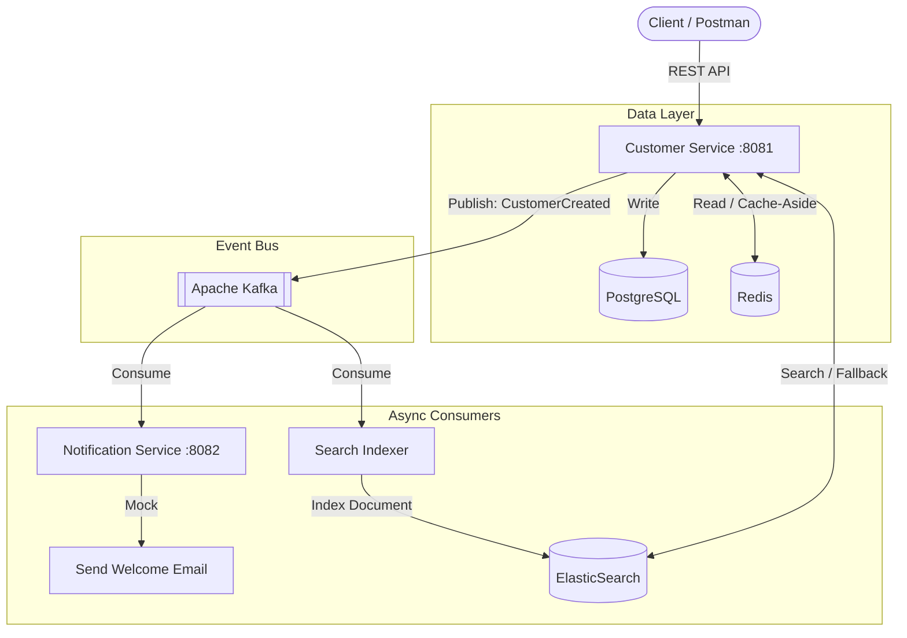

# 🏦 Distributed Banking System (DBS)


A highly scalable, fault-tolerant, and event-driven microservices architecture designed for modern banking CRM and transaction processing. Built with **Java 21** and **Spring Boot 3**, this project demonstrates enterprise-level software engineering patterns.

## 🏗️ Architecture & High-Level Design

This system embraces **Event-Driven Architecture (EDA)** to decouple services and ensure high availability.



## 🚀 Key Enterprise Patterns Implemented

*   **Domain-Driven Design (DDD) & Hexagonal Architecture:** Clear separation between API, Application, Domain, and Infrastructure layers.
*   **Event-Driven Communication:** Services communicate asynchronously via **Apache Kafka** to avoid tight coupling and prevent cascading failures.
*   **High-Performance Caching:** Read-heavy operations are cached using **Redis** with a Cache-Aside pattern and automated cache-eviction (`@CacheEvict`).
*   **Full-Text Search:** Millions of records can be searched in milliseconds using **ElasticSearch**. Data is indexed asynchronously via Kafka consumers.
*   **Fault Tolerance & Resiliency:** Integrated **Resilience4j** for:
    *   *Circuit Breaker:* Protects the system when ElasticSearch is down, returning graceful fallbacks.
    *   *Rate Limiting:* Protects APIs from DDoS or spam requests (HTTP 429 Too Many Requests).
*   **Observability:** Exposed `/actuator/prometheus` endpoints. **Prometheus** scrapes the metrics, and **Grafana** visualizes JVM health, CPU, and HTTP traffic.
*   **Global Exception Handling:** Standardized error responses (RFC 7807 like) for business logic, 404s, and validation errors.

## 🛠️ Tech Stack

*   **Backend:** Java 21, Spring Boot 3.3, Spring Data JPA, Spring Kafka
*   **Databases:** PostgreSQL (Primary), Redis (Cache), ElasticSearch (Search Engine)
*   **Messaging:** Apache Kafka, Zookeeper
*   **Resiliency:** Resilience4j
*   **Mapping & Boilerplate:** MapStruct, Lombok
*   **Observability:** Micrometer, Prometheus, Grafana
*   **DevOps:** Docker, Docker Compose, Multi-stage builds

## ⚙️ How to Run (Getting Started)

The entire ecosystem is containerized. You do not need to install Kafka, Postgres, or Redis on your local machine.

### Prerequisites
*   Docker & Docker Compose installed.
*   Make sure ports `8081`, `8082`, `5432`, `9092`, `6379`, `9200`, `9090`, and `3000` are free.

### Build and Start
Run the following command in the root directory:
```bash
docker-compose up --build -d
```

*Wait approximately 30-40 seconds for ElasticSearch and Kafka to become fully healthy. The Spring Boot services will automatically wait for their dependencies before starting.*

## 📡 API Endpoints (Customer Service)

**Base URL:** `http://localhost:8081/api/v1/customers`

| Method | Endpoint | Description |
| :--- | :--- | :--- |
| `POST` | `/` | Create a new customer (Triggers Kafka Event) |
| `GET` | `/` | Get all customers (Cached in Redis) |
| `GET` | `/{customerNumber}` | Get customer by ID (Cached in Redis) |
| `GET` | `/search?query={text}` | Full-text search (Queries ElasticSearch, protected by Circuit Breaker) |

### Example POST Payload
```json
{
  "firstName": "John",
  "lastName": "Doe",
  "email": "john.doe@example.com",
  "taxNumber": "12345678901"
}
```

## 📊 Observability (Monitoring)

Once the system is up, you can monitor its health:
*   **Prometheus Targets:** `http://localhost:9090/targets` (Check if services are UP)
*   **Grafana Dashboard:** `http://localhost:3000`
    *   *Credentials:* `admin` / `admin`
    *   *Tip:* Import Dashboard ID `11378` for a ready-to-use Spring Boot JVM monitor.

## 🗺️ Roadmap / Future Enhancements

- [ ] **Security:** Implement Keycloak (OAuth2/OpenID Connect) for API security.
- [ ] **API Gateway:** Add Spring Cloud Gateway for centralized routing and global rate-limiting.
- [ ] **Account Service:** Add a new microservice to manage ledger and balances using Event Sourcing.
- [ ] **Kubernetes:** Provide K8s deployment YAMLs for cluster orchestration.